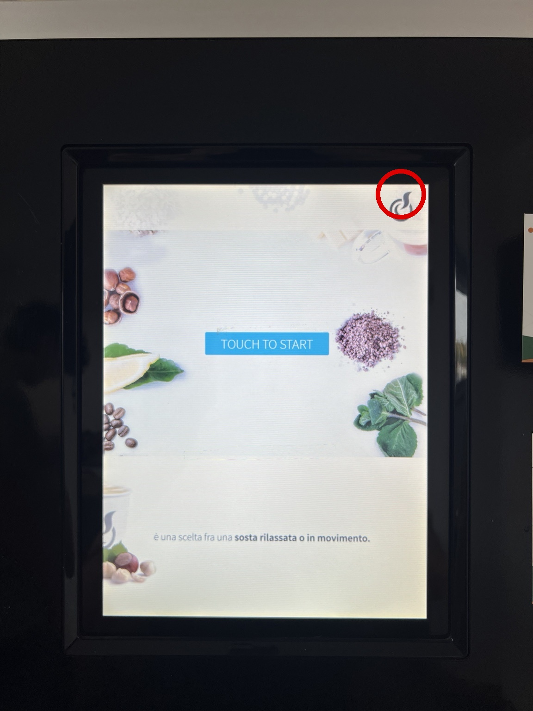
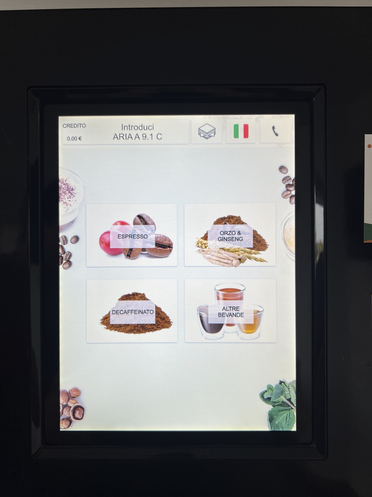
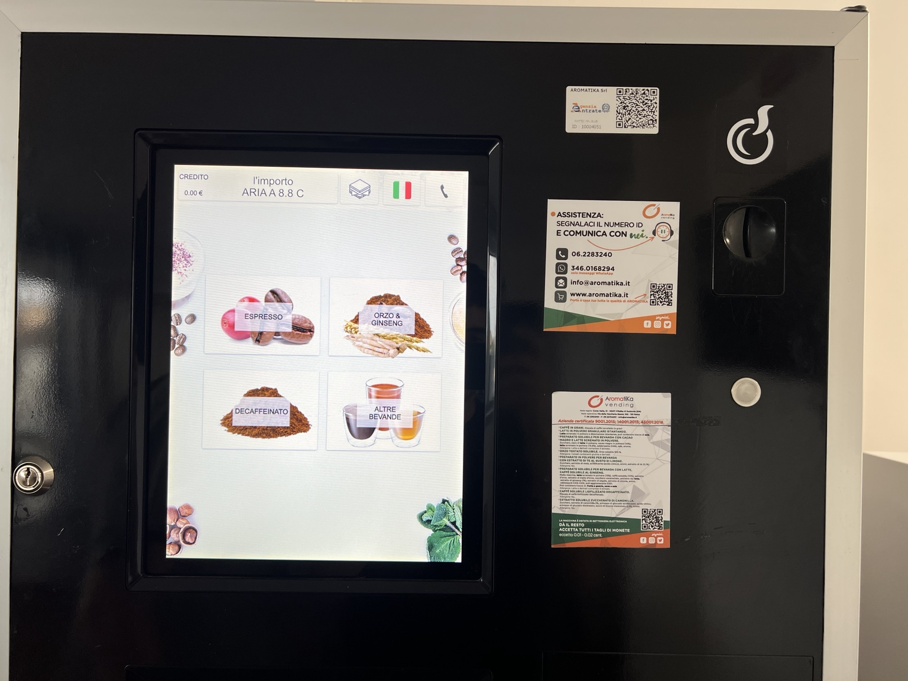
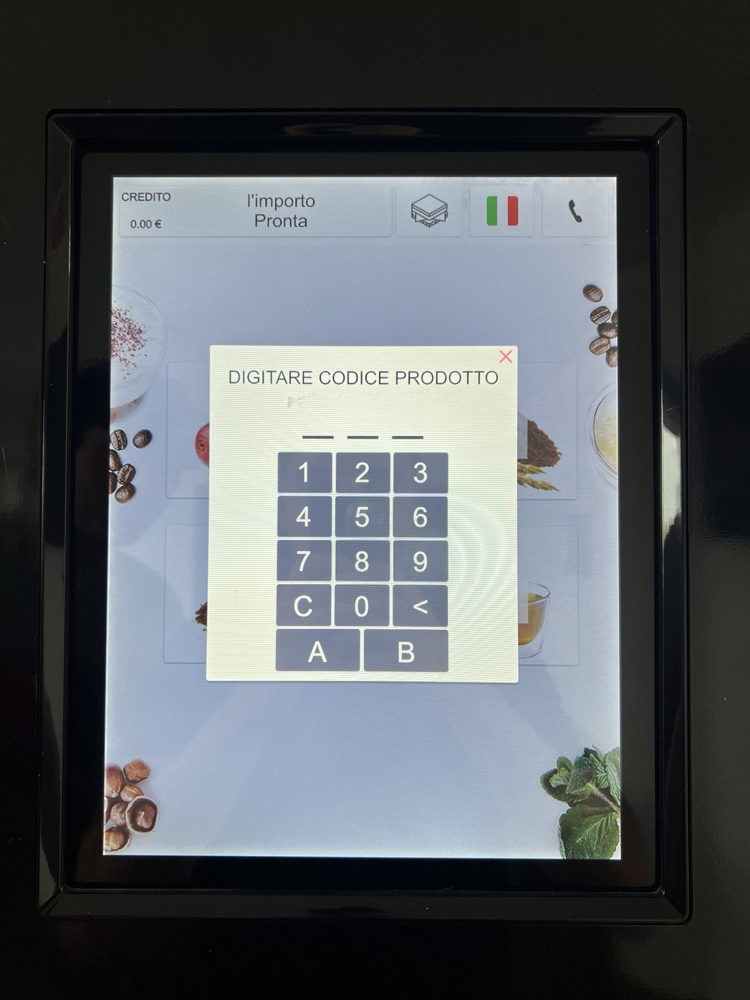

# Coffee & Snack Vending Machine User Guide

This repository provides a concise operating guide for the coffee, snack, and cold-drink vending machine.

## 1. Start the machine



1. Tap **TOUCH TO START**.
2. If the screen does not respond, tap the **symbol in the upper-right corner** of the display, highlighted in red in the image above.
3. If the machine still does not respond, **wait approximately one minute and try again**.

---

## 2. Select a hot beverage



1. Tap the image corresponding to the desired beverage.
2. Follow the payment instructions shown on the machine.
3. If the display does not respond, **wait approximately one minute and try again**.

---

## 3. If the beverage selection does not respond



If the beverage menu remains unresponsive after waiting:

1. Press **EROGA RESTO** on the machine.
2. Wait approximately **one minute**.
3. Return to the beverage menu and try the selection again.

---

## 4. Buy snacks or cold drinks



1. Tap the **sandwich icon** at the top of the display.
2. Enter the **product number** corresponding to the desired snack or cold drink.
3. **Immediately after entering the product number, insert the required payment.**
4. If the machine does not respond, **wait approximately one minute and retry the procedure**.

---

## Troubleshooting

| Problem | Action |
|---|---|
| Start screen does not respond | Tap the upper-right activation symbol. If necessary, wait one minute and retry. |
| Beverage selection does not respond | Wait one minute. If the issue persists, press **EROGA RESTO**, wait, and retry. |
| Snack or cold-drink purchase does not start | Re-enter the product number and insert payment immediately afterwards. If necessary, wait one minute and retry. |

## Repository structure

```text
coffee-machine-guide/
├── README.md
└── images/
    ├── 01-start-screen.jpg
    ├── 01-start-screen-activation-symbol.jpg
    ├── 02-beverage-menu.jpg
    ├── 03-snack-selection.jpg
    └── 04-machine-controls.jpg
```
